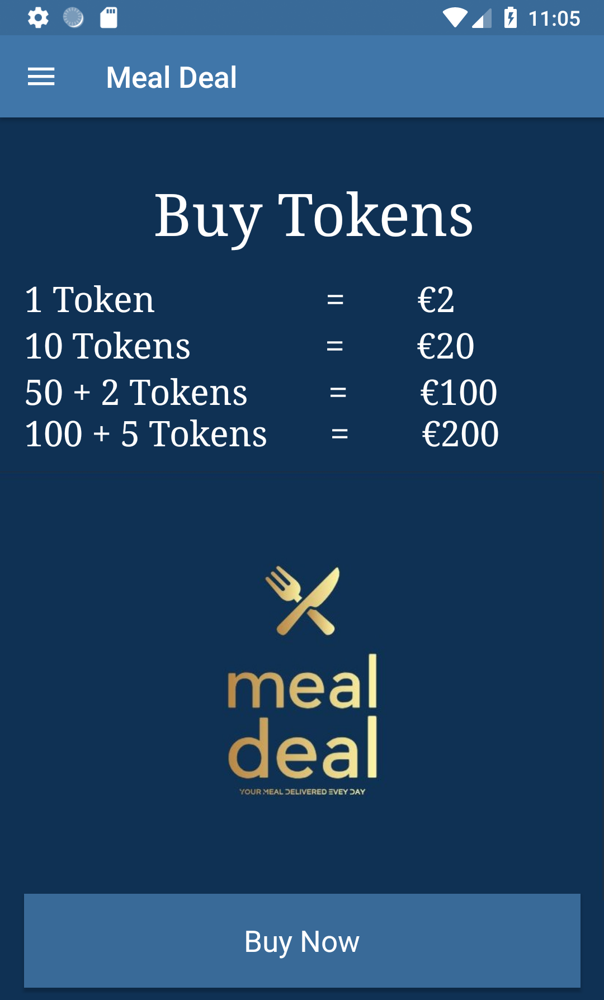

# Android-Kotlin-Ecommerce-App

&nbsp;&nbsp;&nbsp;&nbsp;&nbsp;&nbsp;&nbsp;&nbsp;&nbsp;&nbsp;&nbsp;&nbsp;&nbsp;
&nbsp;&nbsp;&nbsp;&nbsp;&nbsp;&nbsp;&nbsp;&nbsp;&nbsp;&nbsp;&nbsp;&nbsp;&nbsp;


[](https://opensource.org/licenses/MIT)

<b>An E-Commerce application developed with Android Studio using Gson, a REST API and Kotlin.</b>
<br>


<br>

---

### Main Page


<br>

---

### Item 


<br>

---

### Tokens 


<br>

---

### Contact Us 


<br>

---

### About Us 


<br>

---

## Products Adaptar
```
class ProductsAdapter(private val products: List<Product>) : RecyclerView.Adapter<ProductsAdapter.ViewHolder>() {

    override fun onBindViewHolder(holder: ProductsAdapter.ViewHolder, position: Int) {
        val product = products[position]
        Picasso.get().load(product.photoUrl).into(holder.image)
        holder.title.text = product.title
        holder.price.text = product.price
    }

    override fun onCreateViewHolder(parent: ViewGroup, viewType: Int): ViewHolder {
        val view = LayoutInflater.from(parent.context).inflate(R.layout.product_row, parent, false)
        val holder = ViewHolder(view)
        view.setOnClickListener {
            val intent = Intent(parent.context, ProductDetails::class.java)
            intent.putExtra("title", products[holder.adapterPosition].title)
            intent.putExtra("photo_url", products[holder.adapterPosition].photoUrl)
            intent.putExtra("price", products[holder.adapterPosition].price)
            parent.context.startActivity(intent)
        }
        return holder
    }
```

<br>

---

## JSON Items
```
{
	"name": "Item NameFalafel burgers",
	"photo_url": "Item Image Url",
	"price": 10
}
```

<br>

---

## External API
```
        doAsync {
            val json = URL("https://api.myjson.com/bins/$$$$$$").readText()
            uiThread {
                val products = Gson().fromJson(json, Array<Product>::class.java).toList()
                root.recycler_view.apply {
                    layoutManager = GridLayoutManager(activity, 2)
                    adapter = ProductsAdapter(products)
                    root.progressBar.visibility = View.GONE
                }
            }
        }
```


